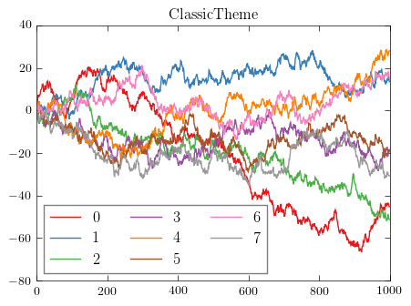

# pyplotthemes

A wrapper around matplotlib with themes.

TODO: write this readme

# Examples

    %matplotlib inline
    %load_ext autoreload
    %autoreload 2
    import numpy as np
    
    from pyplotthemes import themes

## Logarithmic plots

    def logtest(theme):
        theme.figure(figsize=(15,5))
    
        for sub in range(3):
            # Set the random seed for consistency
            np.random.seed(12)
            theme.subplot(131 + sub)
            # Show the whole color range
            for i in range(8):
                y = 1 + np.random.uniform(size=10).cumsum()
                x = np.arange(10)
    
                if sub == 0:
                    theme.semilogx(x, y, label=str(i), marker='o')
                elif sub == 1:
                    theme.semilogy(x, y, label=str(i), marker='o')
                else:
                    theme.loglog(x, y, label=str(i), marker='o')
                    
                theme.legend(loc='best', ncol=3)
        
    
    for name, theme in themes.items():
        if name != "base":
            theme.latex = True
        logtest(theme)
        theme.gcf().suptitle(name)

    def histtest(theme):
        # Set the random seed for consistency
        np.random.seed(12)
        
        theme.figure(figsize=(5,4))
        
        x = np.random.normal(size=1000)
        
        theme.hist(x, label='A label')
        theme.legend(loc='best')
        
    for name, theme in themes.items():
        if name != "base":
            theme.latex = True
        histtest(theme)
        theme.title(name)

    def plottest(theme):
        # Set the random seed for consistency
        np.random.seed(12)
    
        theme.figure(figsize=(5,4))
    
        # Show the whole color range
        for i in range(8):
            y = np.random.normal(size=1000).cumsum()
            x = np.arange(1000)
    
            theme.plot(x, y, label=str(i))
    
        theme.legend(loc='best', ncol=3)
        
    
    for name, theme in themes.items():
        if name != "base":
            theme.latex = True
        plottest(theme)
        theme.title(name)

