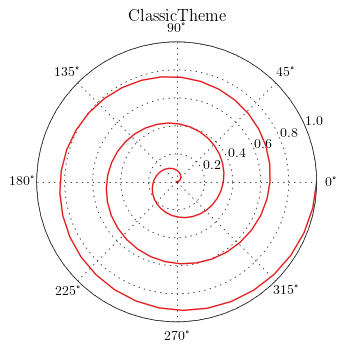
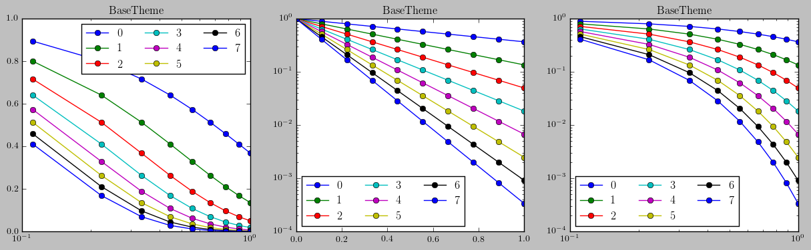
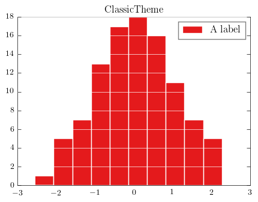
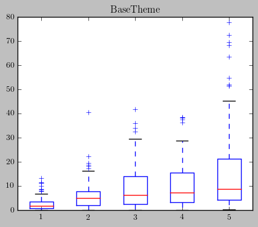
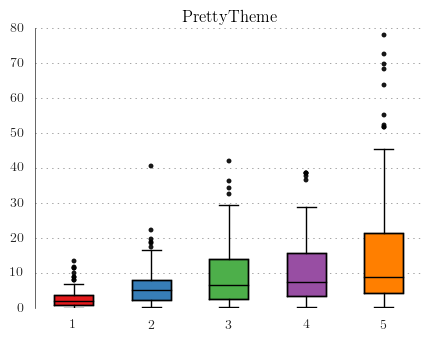
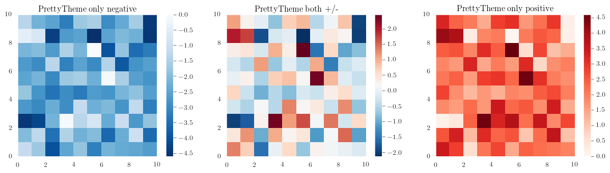

# pyplotthemes

A wrapper around matplotlib with themes.

## Usage:
Instead of doing the typical

```python
    from matplotlib import pyplot as plt
```

you instead import the theme you want


```python
    from pyplotthemes import classictheme as plt
```

Every method/attribute in pyplot is available in the themes so this can be
a one line replacement to get away from the default settings.

## Why another theme package?
There are several packages available that try to change the way your plots look.
Most change the matplotlib *rcParams*, but go no further. In addition, they
assume
you have not edited your *rcParams* file beforehand, and it's not trivial to use
many different
themes in the same program.

This package tries to achieve the following:

* Every plotting call assumes nothing about styles, and will reset the
*rcParams* before every call. This makes it possible to use several themes in
one program and ensures consistency even if you've edited your *rcParams* file.
* Tweak things that can't be tweaked with *rcParams*, like axes positioning,
legend alpha, etc.
* Allow everything to be customized. You can override all *rcParam* values in
the theme constructor or before/after plotting calls with the *setstyle* method.

# Examples


    %matplotlib inline
    import numpy as np
    
    # Here I import all themes, you might want to do "from pyplotthemes import theme as plt" instead
    from pyplotthemes import basetheme, classictheme, prettytheme
    
    
    # For easy iteration in the examples
    themes = [basetheme, classictheme, prettytheme]
    names = [theme.__class__.__name__ for theme in themes]
    # Set Latex to true in non-base themes
    for name, theme in zip(names, themes):
        theme.latex = (name != basetheme.__class__.__name__)

## Basic plot with legend

Note the differences in backgrounds, frames, and ticks.


    def plottest(theme):
        # Set the random seed for consistency
        np.random.seed(0)
    
        theme.figure(figsize=(5,4))
    
        # Show the whole color range
        for i in range(8):
            y = np.random.normal(size=1000).cumsum()
            x = np.arange(1000)
    
            theme.plot(x, y, label=str(i))
    
        theme.legend(loc='best', ncol=3)
        
    
    for name, theme in zip(names, themes):
        plottest(theme)
        theme.title(name)


## Polar axes

To get a polar projection you need to create the axes before plotting.
Either with `axes` or with `subplot`.


    def plottest(theme):
        angle = np.linspace(0, 3*2*np.pi, 100)
        r = np.linspace(0, 1, 100)
    
        theme.figure(figsize=(5,4))
        # Create a polar axes. Either polar=True, or projection='polar'
        theme.axes(projection='polar')
        # Then just call plot like normal
        theme.plot(angle, r)
        
    
    for name, theme in zip(names, themes):
        plottest(theme)
        theme.title(name)





## Logarithmic axes

Commonly used when the range of values are very large.


    def logtest(theme, name):
        theme.figure(figsize=(15,4))
    
        for sub in range(3):
            theme.subplot(131 + sub)
            theme.title(name)
            # Show the whole color range
            for i in range(8):
                x = np.linspace(0, 1, 10)
                y = np.exp(-x*(i + 1))
    
                if sub == 0:
                    theme.semilogx(x, y, label=str(i), marker='o')
                elif sub == 1:
                    theme.semilogy(x, y, label=str(i), marker='o')
                else:
                    theme.loglog(x, y, label=str(i), marker='o')
                    
                theme.legend(loc='best', ncol=3)
        
    
    for name, theme in zip(names, themes):
        logtest(theme, name)





## Histograms

Notice that some non-base themes have visible grids which makes the actual
values easier to read.


    def histtest(theme):
        np.random.seed(0)
        theme.figure(figsize=(5,4))
        
        x = np.random.normal(size=100)
        
        theme.hist(x, label='A label')
        theme.legend(loc='best')
        
    
    for name, theme in zip(names, themes):
        histtest(theme)
        theme.title(name)





## Boxplot


    def boxtest(theme):
        np.random.seed(0)
        theme.figure(figsize=(5,4))
        
        x = []
        for j in range(5):
            x.append(np.random.exponential(3*(j + 1), size=100))
        
        theme.boxplot(x)
        #theme.legend(loc='best')
        
    
    for (name, theme) in zip(names, themes):
        boxtest(theme)
        theme.title(name)








## Heatmaps


    def heattest(theme, mins):
        np.random.seed(10)
        x = np.random.normal(size=(10, 10))
        
        if mins < 0:
            # Force into negative
            x = x - np.max(x)
        elif mins > 0:
            # Force into positive
            x = x - np.min(x)
        
        p = theme.pcolormesh(x)
        theme.colorbar(p)
        
        
    
    for (name, theme) in zip(names, themes):
        theme.figure(figsize=(15,4))
        for mins, a in zip([-1, 0, 1], [131, 132, 133]):
            theme.subplot(a)
            heattest(theme, mins)
            
            t = name
            if mins < 0:
                t += " only negative"
            elif mins == 0:
                t += " both +/-"
            else:
                t += " only positive"
            theme.title(t)




